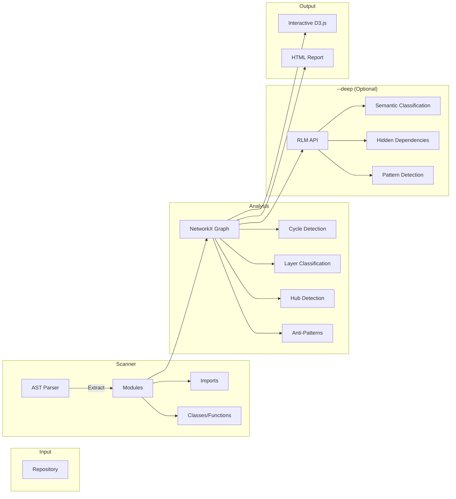
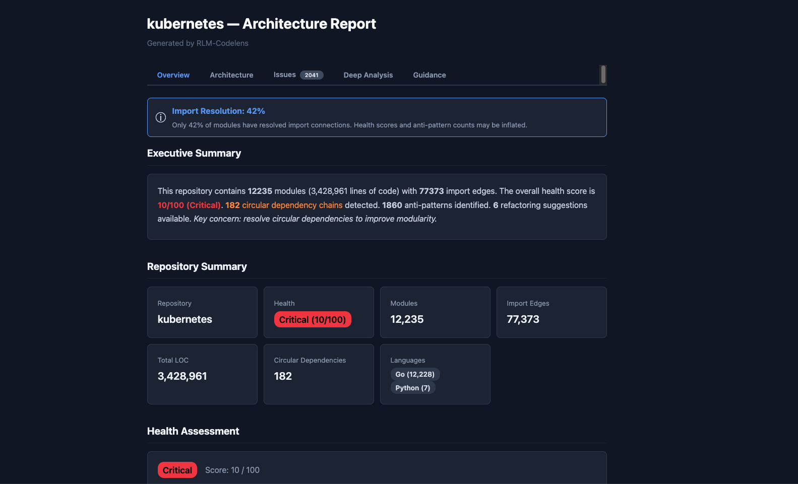
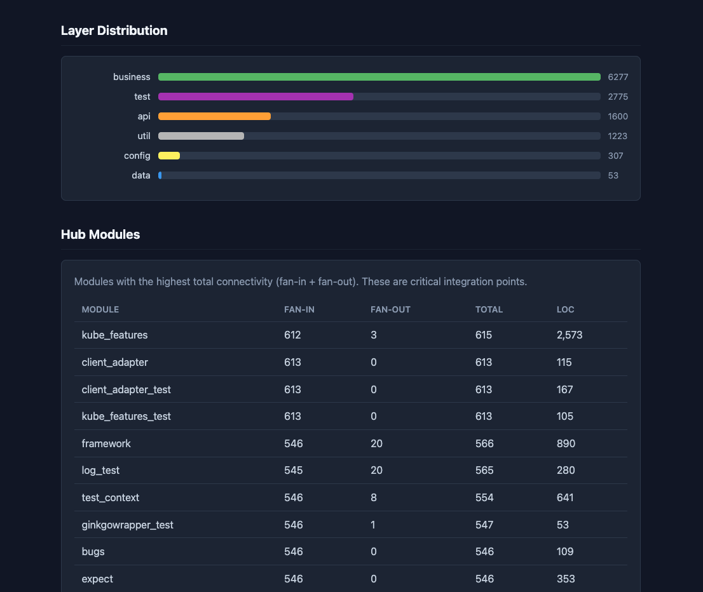
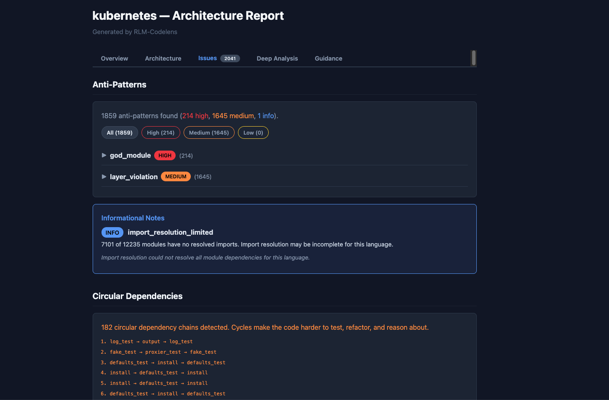
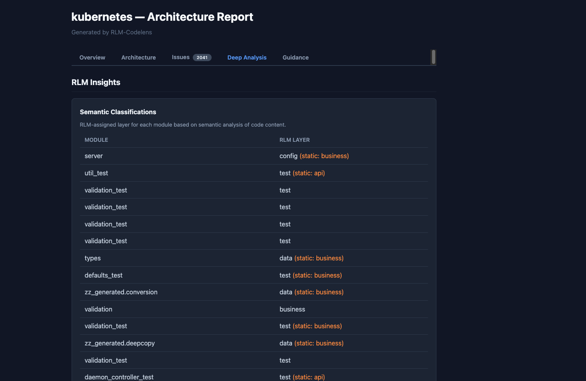
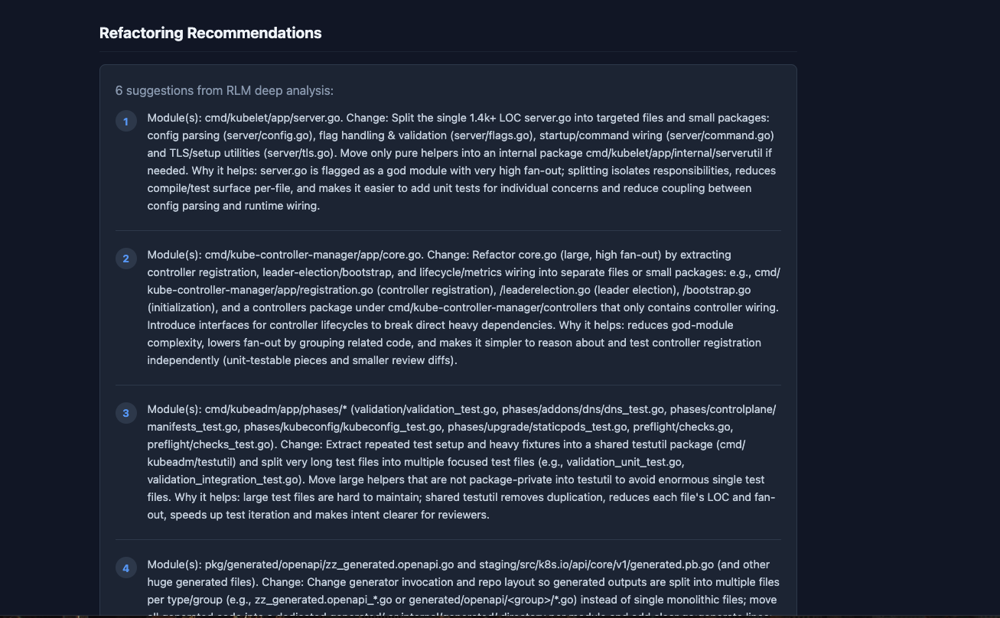
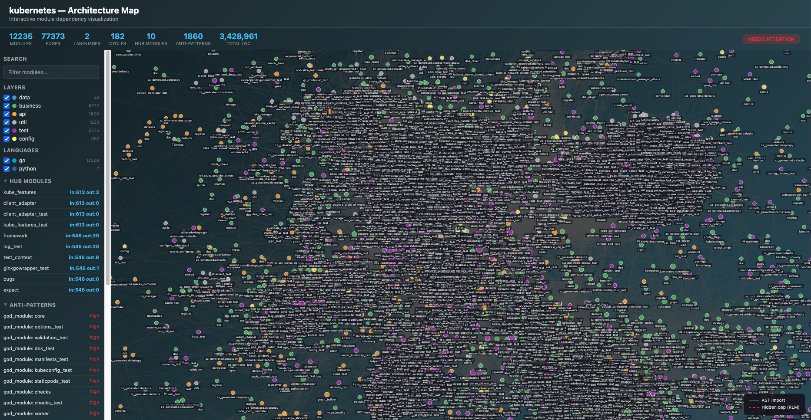

# RLM-Codelens

[](https://python.org)
[](LICENSE)
[](https://github.com/astral-sh/ruff)

> **Whole-codebase architecture intelligence powered by Recursive Language Models.**

## The Problem

Understanding a large codebase is one of the hardest problems in software engineering. Developers spend more time reading code than writing it, and the mental model of "how this system fits together" is usually locked inside the heads of senior engineers.

| Challenge | Why LLMs Fail | How RLM Works |
|-----------|--------------|---------------|
| Codebases are too large for a single context window | GPT-4 can see ~100K tokens; Kubernetes has 12,000+ files | Recursively decomposes the codebase into manageable chunks |
| Imports form complex dependency graphs | LLMs can't reliably trace transitive dependencies | Builds a real graph with NetworkX, then reasons over it |
| Architecture has layers and patterns | LLMs hallucinate structure without seeing the full picture | Static analysis first, RLM enriches with semantic understanding |
| Anti-patterns hide in the connections | A single file looks fine; problems emerge from relationships | Graph algorithms detect cycles, hubs, and layering violations |

## Multi-Language Support

RLM-Codelens supports scanning and analyzing repositories written in multiple languages.
Tree-sitter grammars are **automatically installed** when you use the language extras — no manual setup required:

```bash
# Install with all language support
uv sync --extra all

# Or pick specific languages
uv sync --extra go --extra java
```

| Language | Parser | Install Extra |
|----------|--------|---------------|
| **Python** | AST (built-in) | included by default |
| **Go** | tree-sitter | `--extra go` |
| **Java** | tree-sitter | `--extra java` |
| **JavaScript/TypeScript** | tree-sitter | `--extra javascript` / `--extra typescript` |
| **Rust** | tree-sitter | `--extra rust` |
| **C/C++** | tree-sitter | `--extra cpp` |

> Python works out of the box. For other languages, just add the extra — tree-sitter grammars are pulled in automatically. Without the grammar, non-Python files are still detected and counted but parsed with basic LOC-only extraction.

## Quick Start

```bash
# Install (Python repos — no extra dependencies needed)
git clone https://github.com/knijesh/rlm-codelens.git
cd rlm-codelens
uv sync --extra dev

# For non-Python repos, add language extras (e.g., Go + Java)
uv sync --extra dev --extra go --extra java

# Scan & Analyze in one step (static analysis - no API keys needed)
uv run rlmc analyze-architecture --repo /path/to/repo

# With RLM deep analysis (requires API key or Ollama)
uv run rlmc analyze-architecture --repo /path/to/repo --deep --budget 5.0

# Or use Ollama (free, local)
uv run rlmc analyze-architecture --repo /path/to/repo --ollama --model deepseek-r1:latest
```

### Demo (No API Keys Required)

```bash
# Runs self-analysis on rlm-codelens repo - no external dependencies
./demo_analysis.sh
```

### Pipeline Script

```bash
./run_analysis.sh /path/to/repo myproject

# For RLM deep analysis
./run_analysis.sh /path/to/repo myproject --deep

# With Ollama (free, local)
./run_analysis.sh . self --ollama --model qwen3:8b

# Generates:
# - outputs/myproject_scan.json    (module structure)
# - outputs/myproject_arch.json    (architecture analysis)
# - outputs/myproject_viz.html     (interactive graph)
# - outputs/myproject_report.html  (detailed report)
```

## How It Works



**Static analysis** works on any codebase with zero API calls. Add `--deep` for **RLM-powered** semantic analysis.

## CLI Reference

| Command | Description |
|---------|-------------|
| `rlmc scan-repo <path>` | Scan repository, extract module structure |
| `rlmc analyze-architecture [scan.json]` | Static analysis (cycles, layers, anti-patterns) |
| `rlmc analyze-architecture --repo <path>` | Scan + analyze in one step |
| `rlmc analyze-architecture [scan.json] --deep` | RLM-powered deep analysis |
| `rlmc analyze-architecture [scan.json] --ollama` | Local Ollama for deep analysis |
| `rlmc list-models` | List available Ollama models |
| `rlmc visualize-arch <arch.json>` | Interactive D3.js visualization |
| `rlmc generate-report <arch.json>` | HTML architecture report |

### Key Flags

| Flag | Description |
|------|-------------|
| `--deep` | Enable RLM semantic analysis |
| `--ollama` | Use local Ollama (free) |
| `--budget <$>` | RLM API budget limit in USD (default: $10, env: $50) |
| `--model <name>` | Model to use (gpt-4o, claude-sonnet-4, deepseek-r1, etc.) |
| `--include-source` | Include source code for deeper analysis |

## Proven at Scale

RLM-Codelens has been tested on real-world repositories:

| Repository | Language | Files | LOC | Import Edges | Cycles | Anti-Patterns |
|------------|----------|-------|-----|--------------|--------|---------------|
| **Kubernetes** | Go | 12,235 | 3.4M | 77,373 | 182 | 1,860 |
| **gRPC** | C/C++/Python | 7,163 | 1.2M | 35 | 0 | 1 |
| **Kubernetes Java Client** | Java | 3,017 | 2.1M | 6,447 | 14 | 267 |
| **vLLM** | Python | 2,594 | 804K | 12,013 | 24 | 341 |
| **rlm-codelens** | Python | 23 | 6,824 | 17 | 0 | 3 |

## Sample Output

Screenshots from a Kubernetes (Go, 12,235 files) analysis with `--deep` RLM insights.
Also tested on **gRPC** (C/C++/Python, 7,163 files) — a true multi-language codebase:

### Report Overview



### Architecture — Layers, Hubs & Fan Metrics



### Anti-Patterns & Cycles



### RLM Deep Insights



### RLM Recommendations



### Interactive Dependency Graph (D3.js)



## Configuration

Create a `.env` file (see `.env.example`):

```env
# Required only for --deep RLM analysis
OPENAI_API_KEY=sk-xxxxxxxxxxxx

# Or use Anthropic
# ANTHROPIC_API_KEY=sk-ant-xxx

# Optional defaults
RLM_BACKEND=openai          # "openai" or "anthropic"
RLM_MODEL=gpt-4o            # Model for deep analysis
BUDGET_LIMIT=50.0            # Max spend in USD (CLI --budget overrides this)
```

## Project Structure

```
rlm-codelens/
├── src/rlm_codelens/
│   ├── cli.py                    # CLI entry point (rlmc)
│   ├── commands.py                # Command implementations
│   ├── config.py                  # Configuration from .env
│   ├── repo_scanner.py            # Multi-language repository scanner
│   ├── language_support.py        # Tree-sitter grammar loading & language detection
│   ├── codebase_graph.py          # Module dependency graph builder
│   ├── architecture_analyzer.py   # RLM-powered deep analysis
│   ├── visualizer.py              # D3.js visualization generator
│   ├── report_generator.py        # HTML report generator
│   └── utils/
│       ├── cost_tracker.py        # RLM API cost tracking & budget enforcement
│       └── secure_logging.py      # Redacted logging for API keys
├── tests/
│   ├── unit/                      # Unit tests
│   └── integration/               # Integration tests
├── media/                         # Screenshots for README
├── run_analysis.sh                # Full pipeline script
├── demo_analysis.sh               # Self-scan demo
└── pyproject.toml
```

## Testing

```bash
# Run all tests
uv run pytest tests/ -v

# Unit tests only
uv run pytest tests/unit/ -v
```

## Python API

```python
from rlm_codelens import RepositoryScanner, CodebaseGraphAnalyzer

# Scan
scanner = RepositoryScanner("/path/to/repo")
structure = scanner.scan()
print(f"{structure.total_files} files, {structure.total_lines:,} LOC")

# Analyze
analyzer = CodebaseGraphAnalyzer(structure)
analysis = analyzer.analyze()
print(f"{len(analysis.cycles)} circular imports")
print(f"{len(analysis.anti_patterns)} anti-patterns")

# Save
analysis.save("architecture.json")
```

## Contributing

See [CONTRIBUTING.md](CONTRIBUTING.md). Please read our [Code of Conduct](CODE_OF_CONDUCT.md).

## License

MIT License - see [LICENSE](LICENSE).

## Credits

- [alexzhang13/rlm](https://github.com/alexzhang13/rlm) - Recursive Language Models
- [NetworkX](https://networkx.org/) - Graph algorithms
- [D3.js](https://d3js.org/) - Interactive visualizations

---

**Author:** Nijesh Kanjinghat ([@knijesh](https://github.com/knijesh))
