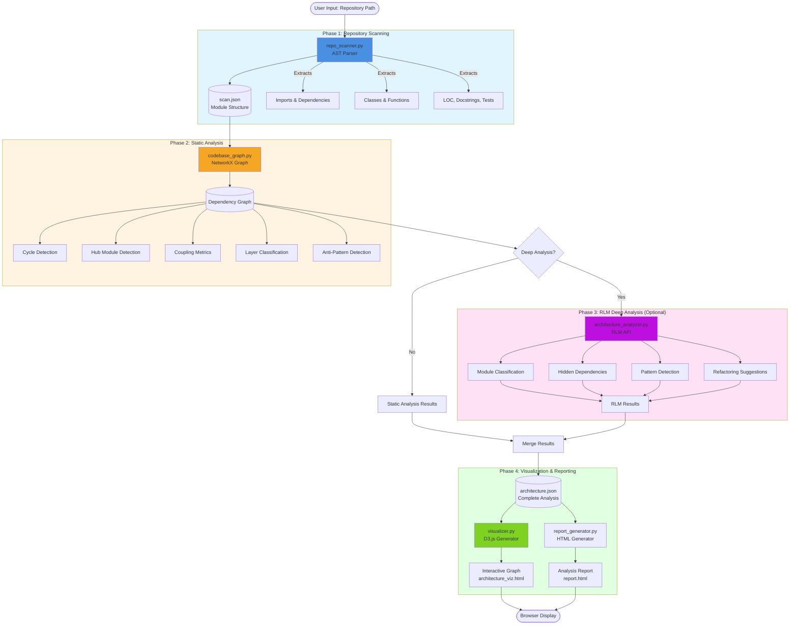
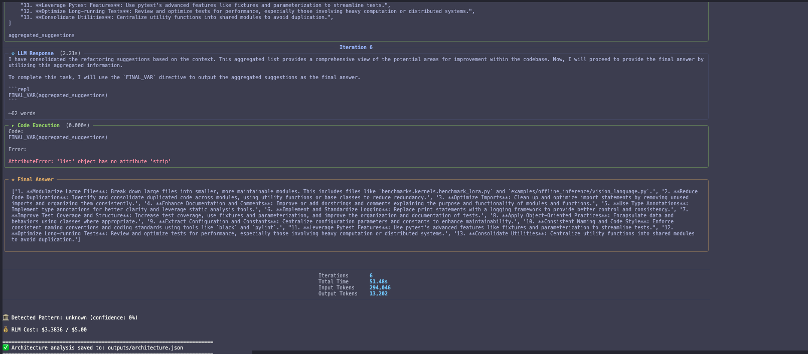
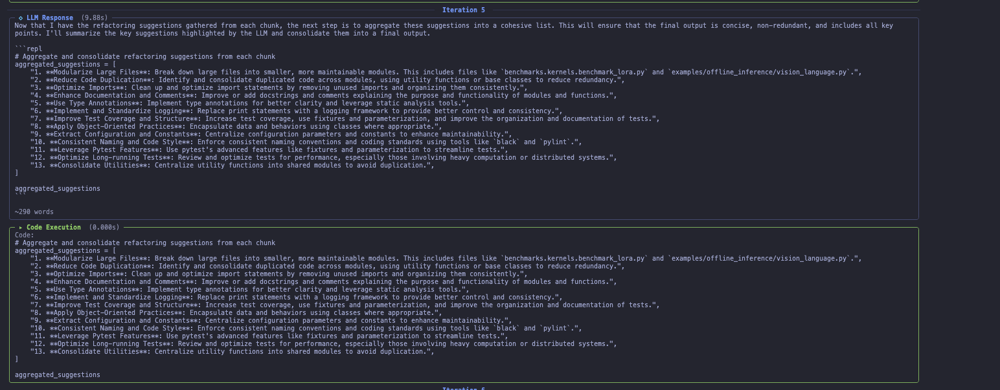

# RLM-Codelens

[](https://python.org)
[](LICENSE)
[](https://github.com/knijesh/rlm-codelens/actions)
[](https://github.com/psf/black)

> **Whole-codebase architecture intelligence powered by Recursive Language Models.**

## The Problem

Understanding a large codebase is one of the hardest problems in software engineering. Developers spend more time reading code than writing it, and the mental model of "how this system fits together" is usually locked inside the heads of senior engineers.

| Challenge | Why LLMs Fail | How RLM Works |
|-----------|--------------|---------------|
| Codebases are too large for a single context window | GPT-4 can see ~100K tokens; vLLM has 2,504 files | Recursively decomposes the codebase into manageable chunks |
| Imports form complex dependency graphs | LLMs can't reliably trace transitive dependencies | Builds a real graph with NetworkX, then reasons over it |
| Architecture has layers and patterns | LLMs hallucinate structure without seeing the full picture | Static analysis first, RLM enriches with semantic understanding |
| Anti-patterns hide in the connections | A single file looks fine; problems emerge from relationships | Graph algorithms detect cycles, hubs, and layering violations |

## How It Works



**Static analysis** works on any codebase with zero API calls. Add `--deep` to enable **RLM-powered semantic analysis** that classifies modules, discovers hidden dependencies, and suggests refactoring.

📐 **[View more architecture diagrams →](docs/ARCHITECTURE_DIAGRAMS.md)**

## Proven at Scale

| Repository | Files | LOC | Modules | Import Edges | Cycles | Anti-Patterns |
|-----------|-------|------|---------|--------------|--------|---------------|
| **Starlette** | 67 | 9,800 | 67 | 106 | 3 | 4 |
| **vLLM** | 2,504 | 483,000 | 2,504 | 7,412 | 127 | 89 |
| **rlm-codelens** (self) | 22 | 3,800 | 22 | 42 | 1 | 3 |

Sample output,reports, visualisation and logs are in [`samples/`](samples/).

## Quick Start

```bash
# Install
git clone https://github.com/knijesh/rlm-codelens.git
cd rlm-codelens
uv sync --extra dev

# Analyze any Python repository in 3 commands
uv run rlmc scan-repo /path/to/repo --output scan.json
uv run rlmc analyze-architecture scan.json --output arch.json
uv run rlmc visualize-arch arch.json
# Opens interactive visualization in your browser
```

Or use the pipeline script:

```bash
./run_analysis.sh /path/to/repo myproject 

#To Run RLM Analysis Explicitly one shot use the below command

 ./run_analysis.sh https://github.com/reponame --deep

# Uses "myproject" as the output name/prefix and generates:
# - outputs/myproject_viz.html   (interactive visualization)
# - outputs/myproject_report.html (detailed architecture report)
```

### Self-Scan Demo (no API keys needed)

```bash
./demo_analysis.sh
```

### Deep RLM Analysis (requires API key)

```bash
# Scan with source text included
uv run rlmc scan-repo /path/to/repo --include-source --output scan.json

# Analyze with RLM-powered insights
uv run rlmc analyze-architecture scan.json --deep --budget 5.0

# Supports OpenAI and Anthropic backends
uv run rlmc analyze-architecture scan.json --deep --backend anthropic --model claude-sonnet-4-5-20250929
```

## CLI Reference

| Command | Description |
|---------|-------------|
| `rlmc scan-repo <path>` | Parse all Python files using AST; extract imports, classes, functions (supports `--name <label>` to tag the analysis/output prefix) |
| `rlmc analyze-architecture <scan.json>` | Build dependency graph, detect cycles, layers, anti-patterns |
| `rlmc visualize-arch <analysis.json>` | Generate interactive D3.js visualization |
| `rlmc generate-report <analysis.json>` | Generate standalone HTML architecture report |

## Configuration

Create a `.env` file (see `.env.example`):

```env
# Required only for --deep RLM analysis
OPENAI_API_KEY=sk-xxxxxxxxxxxx    # if using openai backend
# ANTHROPIC_API_KEY=sk-ant-xxx    # if using anthropic backend

# Optional defaults
RLM_BACKEND=openai
RLM_MODEL=gpt-4o
BUDGET_LIMIT=50.0
```

## Project Structure

```
rlm-codelens/
├── src/rlm_codelens/
│   ├── cli.py                    # CLI entry point (rlmc)
│   ├── commands.py               # Command implementations
│   ├── config.py                 # Configuration from .env
│   ├── repo_scanner.py           # AST-based repository scanner
│   ├── codebase_graph.py         # Module dependency graph builder
│   ├── architecture_analyzer.py  # RLM-powered deep analysis
│   ├── visualizer.py             # D3.js visualization generator
│   └── utils/                    # Cost tracking, logging
├── tests/
│   └── unit/                     # Unit tests
├── outputs/examples/             # Pre-computed analysis results
├── visualization/                # Standalone HTML viewer
├── run_analysis.sh               # Architecture analysis pipeline
├── demo_analysis.sh              # Self-scan demo
└── pyproject.toml
```

## Testing

```bash
# Run all tests
uv run pytest tests/ -v

# Unit tests only
uv run pytest tests/unit/ -v

# With coverage
uv run pytest tests/ --cov=rlm_codelens --cov-report=html
```

## Python API

```python
from rlm_codelens import RepositoryScanner, CodebaseGraphAnalyzer

# Scan
scanner = RepositoryScanner("/path/to/repo")
structure = scanner.scan()
print(f"{structure.total_files} files, {structure.total_lines:,} LOC")

# Analyze
analyzer = CodebaseGraphAnalyzer(structure)
analysis = analyzer.analyze()
print(f"{len(analysis.cycles)} circular imports")
print(f"{len(analysis.anti_patterns)} anti-patterns")

# Save
analysis.save("architecture.json")
```
# Sample Output

### Analysis Report (with `--deep` RLM analysis)





> **View the full HTML report:** [kubernetes_report.html](https://htmlpreview.github.io/?https://github.com/knijesh/rlm-codelens/blob/main/samples/kubernetes_report.html)

### Interactive Architecture Visualization

> **View the full interactive visualization:** [kubernetes_viz.html](https://htmlpreview.github.io/?https://github.com/knijesh/rlm-codelens/blob/main/samples/kubernetes_viz.html)


## Contributing

See [CONTRIBUTING.md](CONTRIBUTING.md). Please read our [Code of Conduct](CODE_OF_CONDUCT.md).

## License

MIT License - see [LICENSE](LICENSE).

## Credits

- [alexzhang13/rlm](https://github.com/alexzhang13/rlm) - Recursive Language Models
- [NetworkX](https://networkx.org/) - Graph algorithms
- [D3.js](https://d3js.org/) - Interactive visualizations

---

**Author:** Nijesh Kanjinghat ([@knijesh](https://github.com/knijesh))
