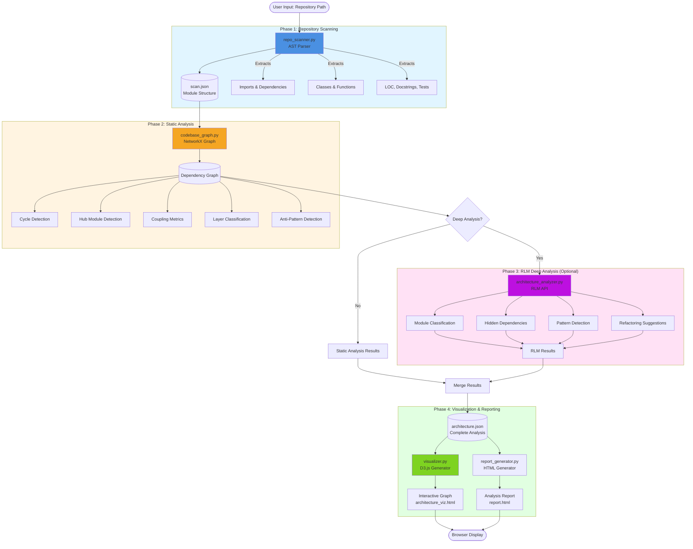
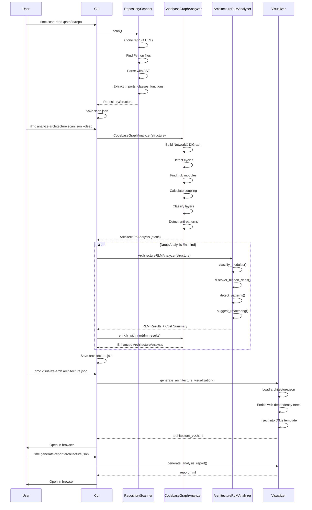
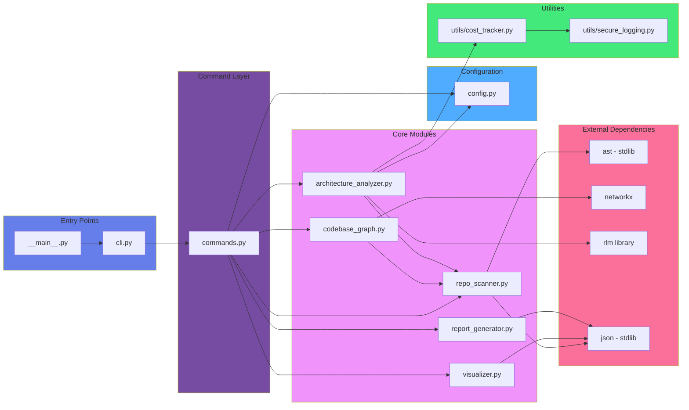
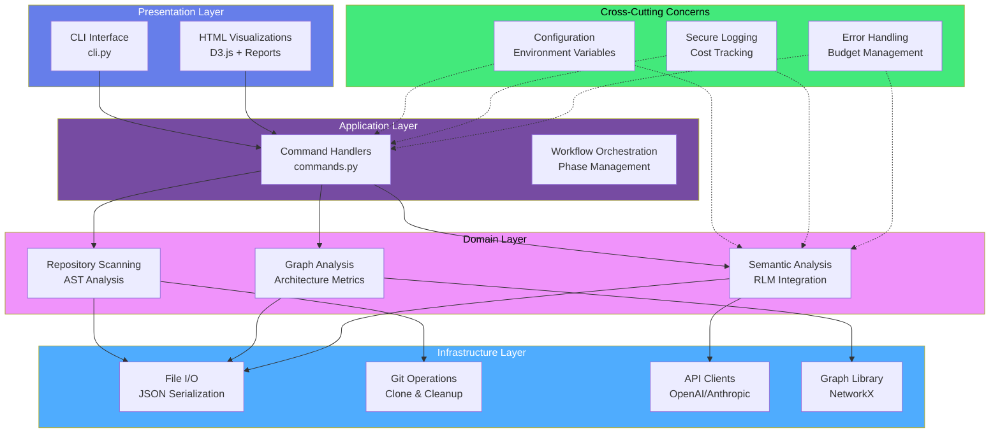
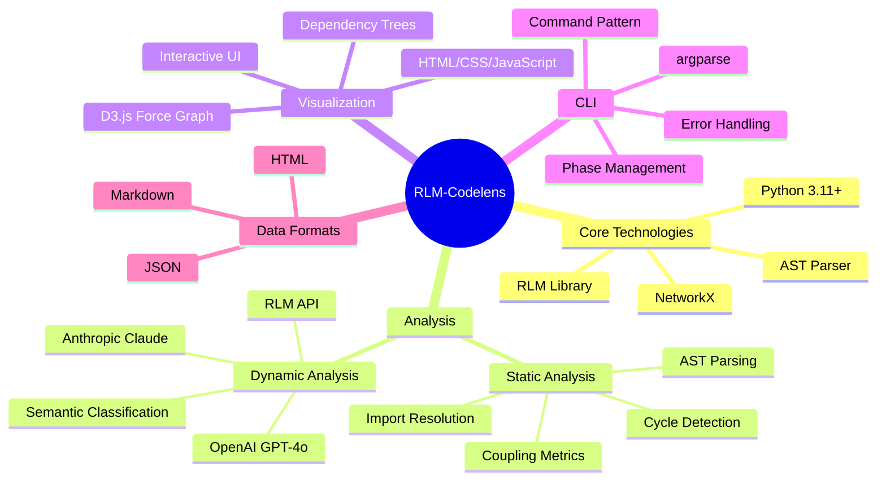

# RLM-Codelens Architecture Diagrams

## 1. High-Level System Flow (Mermaid)



## 2. Detailed Component Architecture (Mermaid)

```mermaid
graph TB
    subgraph CLI["CLI Layer (cli.py)"]
        CLI_Entry[rlmc Command] --> CMD_Scan[scan-repo]
        CLI_Entry --> CMD_Analyze[analyze-architecture]
        CLI_Entry --> CMD_Viz[visualize-arch]
        CLI_Entry --> CMD_Report[generate-report]
    end
    
    subgraph Commands["Command Layer (commands.py)"]
        CMD_Scan --> Cmd_ScanRepo[scan_repository]
        CMD_Analyze --> Cmd_AnalyzeArch[analyze_architecture]
        CMD_Viz --> Cmd_Visualize[visualize_architecture]
        CMD_Report --> Cmd_GenReport[generate_report]
    end
    
    subgraph Core["Core Analysis Engine"]
        Cmd_ScanRepo --> RepoScanner[RepositoryScanner]
        
        subgraph Scanner["repo_scanner.py"]
            RepoScanner --> AST[AST Parser]
            RepoScanner --> GitClone[Git Clone Handler]
            RepoScanner --> ModuleInfo[ModuleInfo Extractor]
            AST --> Imports[Import Analysis]
            AST --> ClassFunc[Class/Function Analysis]
            ModuleInfo --> RepoStruct[RepositoryStructure]
        end
        
        Cmd_AnalyzeArch --> GraphAnalyzer[CodebaseGraphAnalyzer]
        
        subgraph GraphAnalysis["codebase_graph.py"]
            GraphAnalyzer --> NetworkX[NetworkX DiGraph]
            NetworkX --> CycleDetect[Cycle Detection]
            NetworkX --> HubDetect[Hub Detection]
            NetworkX --> CouplingCalc[Coupling Metrics]
            NetworkX --> LayerDetect[Layer Detection]
            NetworkX --> AntiPatternDetect[Anti-Pattern Detection]
            
            CycleDetect --> ArchAnalysis[ArchitectureAnalysis]
            HubDetect --> ArchAnalysis
            CouplingCalc --> ArchAnalysis
            LayerDetect --> ArchAnalysis
            AntiPatternDetect --> ArchAnalysis
        end
        
        Cmd_AnalyzeArch --> |--deep flag| RLMAnalyzer[ArchitectureRLMAnalyzer]
        
        subgraph RLM["architecture_analyzer.py"]
            RLMAnalyzer --> RLMClient[RLM API Client]
            RLMClient --> OpenAI[OpenAI Backend]
            RLMClient --> Anthropic[Anthropic Backend]
            
            RLMAnalyzer --> ClassifyModules[classify_modules]
            RLMAnalyzer --> DiscoverHidden[discover_hidden_deps]
            RLMAnalyzer --> DetectPatterns[detect_patterns]
            RLMAnalyzer --> SuggestRefactor[suggest_refactoring]
            
            ClassifyModules --> CostTracker[RLMCostTracker]
            DiscoverHidden --> CostTracker
            DetectPatterns --> CostTracker
            SuggestRefactor --> CostTracker
        end
        
        Cmd_Visualize --> Visualizer[ArchitectureVisualizer]
        
        subgraph Viz["visualizer.py"]
            Visualizer --> EnrichData[Data Enrichment]
            Visualizer --> D3Template[D3.js Template]
            EnrichData --> DepTree[Dependency Trees]
            EnrichData --> CycleMembership[Cycle Membership]
            D3Template --> HTMLGen[HTML Generation]
        end
        
        Cmd_GenReport --> ReportGen[ReportGenerator]
        
        subgraph Report["report_generator.py"]
            ReportGen --> ReportTemplate[HTML Template]
            ReportGen --> Metrics[Metrics Formatting]
            ReportGen --> Charts[Chart Generation]
        end
    end
    
    subgraph Utils["Utilities"]
        CostTracker --> SecureLog[secure_logging.py]
        Config[config.py] --> |Environment| RLMAnalyzer
        Config --> |API Keys| RLMClient
    end
    
    subgraph Data["Data Models"]
        RepoStruct --> JSON1[(scan.json)]
        ArchAnalysis --> JSON2[(architecture.json)]
        HTMLGen --> HTML1[(viz.html)]
        ReportGen --> HTML2[(report.html)]
    end
    
    style CLI fill:#667eea
    style Commands fill:#764ba2
    style Core fill:#f093fb
    style Scanner fill:#4facfe
    style GraphAnalysis fill:#43e97b
    style RLM fill:#fa709a
    style Viz fill:#fee140
    style Report fill:#30cfd0
    style Utils fill:#a8edea
    style Data fill:#fed6e3
```



## 3. Data Flow Architecture (Mermaid)



## 4. Module Dependency Graph (Mermaid)



## 5. Layer Architecture (Conceptual)



## 6. Technology Stack



## Key Components Description

### 1. **RepositoryScanner** (`repo_scanner.py`)
- **Purpose**: Parse Python repositories using AST
- **Input**: Local path or Git URL
- **Output**: `RepositoryStructure` with modules, imports, classes, functions
- **Key Features**:
  - Git clone support for remote repos
  - Configurable exclusion patterns
  - Optional source code inclusion
  - Relative import resolution

### 2. **CodebaseGraphAnalyzer** (`codebase_graph.py`)
- **Purpose**: Build and analyze module dependency graph
- **Input**: `RepositoryStructure`
- **Output**: `ArchitectureAnalysis` with metrics
- **Key Features**:
  - NetworkX directed graph construction
  - Cycle detection (circular imports)
  - Hub module identification
  - Coupling metrics (afferent/efferent)
  - Layer classification heuristics
  - Anti-pattern detection

### 3. **ArchitectureRLMAnalyzer** (`architecture_analyzer.py`)
- **Purpose**: Deep semantic analysis using RLM
- **Input**: `RepositoryStructure` + optional graph metrics
- **Output**: Semantic clusters, hidden deps, patterns, suggestions
- **Key Features**:
  - Module classification into architectural layers
  - Dynamic import discovery
  - Pattern detection (MVC, layered, etc.)
  - Refactoring suggestions
  - Cost tracking and budget enforcement

### 4. **Visualizer** (`visualizer.py`)
- **Purpose**: Generate interactive D3.js visualizations
- **Input**: `ArchitectureAnalysis` JSON
- **Output**: Standalone HTML with embedded data
- **Key Features**:
  - Force-directed graph layout
  - Interactive node exploration
  - Dependency tree tracer
  - Layer-based coloring
  - Cycle highlighting

### 5. **CLI** (`cli.py` + `commands.py`)
- **Purpose**: Command-line interface
- **Commands**:
  - `scan-repo`: Parse repository
  - `analyze-architecture`: Run analysis
  - `visualize-arch`: Generate visualization
  - `generate-report`: Create HTML report
- **Features**:
  - Pipeline support
  - Progress reporting
  - Error handling
  - Browser auto-open

## Analysis Pipeline

```
Repository → AST Scanner → Dependency Graph → Architecture Analysis → Interactive Visualization
   (input)     (parse every    (NetworkX graph    (anti-patterns, layers,    (D3.js force-directed
                Python file)    of imports)        hub modules, cycles)       graph in HTML)
```

### Static Analysis (No API calls)
1. Parse all Python files with AST
2. Extract imports, classes, functions
3. Build NetworkX directed graph
4. Detect cycles, hubs, coupling
5. Classify layers heuristically
6. Identify anti-patterns

### Deep RLM Analysis (Optional, requires API key)
1. Classify modules semantically
2. Discover hidden/dynamic dependencies
3. Detect architectural patterns
4. Generate refactoring suggestions
5. Track costs and enforce budget

## Anti-Patterns Detected

1. **God Modules**: Large files (>500 LOC) with high fan-out (>10)
2. **Orphan Modules**: No imports or dependents
3. **Layer Violations**: Lower layers importing higher layers
4. **Circular Imports**: Detected via NetworkX cycle detection
5. **Tight Coupling**: High instability metrics

## Output Artifacts

1. **scan.json**: Repository structure with all modules
2. **architecture.json**: Complete analysis results
3. **architecture_viz.html**: Interactive D3.js graph
4. **report.html**: Detailed analysis report

---

**Generated for**: RLM-Codelens v0.2.1  
**Author**: Nijesh Kanjinghat  
**License**: MIT